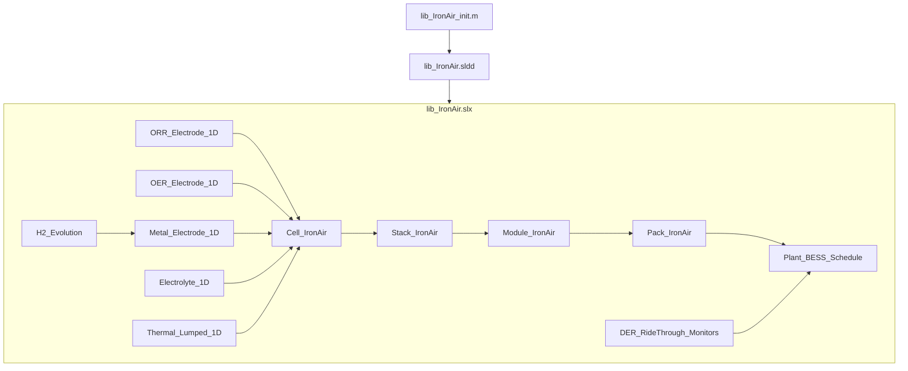

# Iron-Air Battery First-Principles Simulation Plan

## Locked Decisions

| Topic | Choice |
|-------|--------|
| Scope | Full stack; small library blocks compose larger ones |
| Substrate | Pure Simulink continuous ODEs (no Simscape custom components) |
| Chemistry | Aqueous alkaline iron–air |
| Electrodes | Separate ORR, OER, metal + electrolyte between O₂ electrodes and metal |
| Electrolyte | Static flooded KOH |
| Spatial | 1D porous / transport domains |
| Timescales | Electrical + thermal + multi-day; multi-rate; unit-test each block |
| Standards | StrictDoc + Simulink linkage/monitors |
| Data | Synthetic mock cell curves for verification |
| Packaging | Single [`lib_IronAir.slx`](../lib_IronAir.slx); no `.prj`; no Library Browser registration |
| Parameters | [`lib_IronAir_init.m`](../lib_IronAir_init.m) populates [`lib_IronAir.sldd`](../lib_IronAir.sldd) |
| Safety physics (v1) | Include H₂ evolution |
| Grid | Plant-level power/energy schedule (no switching inverter) |
| Requirements | StrictDoc in [`requirements/`](../requirements/) (not Doorstop); HTML → [`requirements_html/`](../requirements_html/) |
| v1 demo | 24–100 h energy arbitrage with DER ride-through |

## Architecture



**Composition rule:** every higher-level subsystem is only library-linked instances of lower-level masked blocks plus thin wiring/aggregation (series/parallel, buses, schedules). No duplicated physics at higher levels.

## First-Principles Physics (v1)

### Electrode / electrolyte domains (1D)

- Discretize each 1D domain with \(N_x\) control volumes (parameters in SLDD).
- Species/ionic transport in alkaline electrolyte via Nernst–Planck / concentrated KOH effective diffusivity and conductivity (Fick + migration approximation acceptable for v1).
- Metal electrode: Fe / Fe(OH)₂ / Fe₃O₄ progression with Faraday’s law SOC states and solid-phase utilization.
- ORR (discharge air cathode): \(\mathrm{O_2 + 2H_2O + 4e^- \rightarrow 4OH^-}\) with Butler–Volmer / Tafel kinetics and O₂ mass-transport limitation.
- OER (charge anode): reverse oxygen evolution on dedicated electrode; same electrolyte domain shared or coupled through separator nodes.
- Separator/electrolyte block: ohmic drop, OH⁻ concentration profiles, bridging ORR/OER domain to metal domain.
- **H₂ evolution (v1 required):** parasitic HER on metal electrode \(\mathrm{2H_2O + 2e^- \rightarrow H_2 + 2OH^-}\); track H₂ molar rate, cumulative volume, and Faradaic efficiency loss.

### Electrical continuous ODEs

- Cell voltage \(V = E_\mathrm{eq}(\mathbf{c},T) - \eta_\mathrm{metal} - \eta_\mathrm{ORR/OER} - IR_\mathrm{elec}\).
- Current continuity across electrodes; charge conservation ODEs for double-layer optional (can start with quasi-steady kinetics + 1D concentration ODEs).
- Continuous-time only; variable-step solvers (e.g. `ode15s` / `ode23tb`) for stiff chemistry.

### Thermal

- 1D or lumped multi-node thermal ODE coupled to Joule heat + reaction enthalpies; feeds Arrhenius kinetics.

### Multi-rate / co-simulation

- Library blocks expose sample-time / rate-transition guidance:
  - Fast electrical observables (voltage, current) for ride-through monitors
  - Medium thermal
  - Slow SOC / multi-day arb schedule
- Demo model uses Simulink rate transitions / multi-tasking or separate referenced models with co-sim schedule documented in SDD; each atomic block remains independently simulatable at its native rate.

## Library Block Inventory (`lib_IronAir.slx`)

All blocks: masked subsystems, continuous ODEs, parameters from SLDD via mask promotions.

| Block | Role |
|-------|------|
| `ORR_Electrode_1D` | 1D ORR kinetics + O₂ transport |
| `OER_Electrode_1D` | 1D OER kinetics |
| `Metal_Electrode_1D` | Fe oxidation/reduction + utilization |
| `Electrolyte_1D` | KOH transport / ohmic between O₂ and metal domains |
| `H2_Evolution` | Parasitic HER; efficiency & H₂ rate outputs |
| `Thermal_Node_1D` | Thermal ODE segment |
| `Cell_IronAir` | Composes electrodes + electrolyte + H₂ + thermal |
| `Stack_IronAir` | Series cells + bus aggregation |
| `Module_IronAir` | Parallel/series stacks |
| `Pack_IronAir` | Pack string aggregation, SOC/energy |
| `Plant_BESS_Schedule` | 24–100 h power/energy schedule plant |
| `DER_RideThrough_Monitors` | IEEE 1547 / UL 1741 style envelope assertions (plant-level, not switching PCS) |
| `Standards_Assert_*` | Linked monitors for UL 9540 / NFPA 855 / IEEE 1547.9 documentary envelopes where simulatable (thermal, H₂, SOC, power) |

Masks: editable geometry, \(N_x\), kinetics constants, initial concentrations, thermal mass; documentation pane cites requirement IDs (`SRS*`, `SSS*`).

## Parameterization

- [`lib_IronAir_init.m`](../lib_IronAir_init.m): single entry point; builds nested structs (`IronAir.Cell`, `.Stack`, `.Plant`, `.Standards`, `.MockData`) and writes/updates [`lib_IronAir.sldd`](../lib_IronAir.sldd).
- No free-floating base-workspace policy after init; models reference the dictionary.
- Synthetic mock discharge/charge V–I–t and coulombic efficiency curves stored under `data/mock/` and loaded by init for regression tests.

## Project Layout

```
plans/                          # this plan (git-tracked)
requirements/
  srs/  sss/  sdd/  irs/  tp/  td/
requirements_html/              # StrictDoc HTML output
lib_IronAir.slx
lib_IronAir_init.m
lib_IronAir.sldd
models/
  demo_Cell_IronAir.slx
  demo_Stack_IronAir.slx
  demo_Plant_EnergyArb_24_100h.slx
tests/                          # Simulink Test or MATLAB unit harnesses per block
data/mock/                      # estimated cell curves
Makefile                        # build/test/strictdoc targets
strictdoc.toml
README.md
.gitignore
```

## StrictDoc Requirements (MIL-STD-498)

Under `requirements/` per MIL-STD-498:

- **SRS** — system goals: aqueous Fe–air BESS model, 24–100 h arb, H₂ tracking, standards compliance intent
- **SSS** — software/model requirements: ODE continuity, 1D domains, library hierarchy, SLDD init, multi-rate, per-block testability
- **SDD** — design: equations, block I/O, mask parameters, multi-rate strategy
- **IRS** — interfaces: signal buses, schedule inputs, monitor outputs, dictionary API
- **TP / TD** — test plan + descriptions linked to SSS; mock-data acceptance criteria

**Standards (traceable SRS children + Simulink linkage):** IEEE 1547-2018, IEEE 1547.9-2022, UL 1741, UL 9540, NFPA 855.

## Verification Strategy

1. **Atomic:** each library block has a harness in `tests/` with mock stimuli; compare against synthetic curves / conservation checks.
2. **Integration:** cell → stack → pack closed-loop charge/discharge.
3. **Plant demo:** `demo_Plant_EnergyArb_24_100h.slx` runs 24–100 h arbitrage; ride-through monitors pass under injected grid envelope events.
4. **Requirements:** TD cases map to harnesses; `make test` + `make strictdoc-validate`.

## Phased Delivery

### Phase 0 — Scaffolding
- Save plan to `plans/`; StrictDoc tree + `strictdoc.toml` + Makefile; library stubs; README; `.gitignore`.

### Phase 1 — Atomic electrochemistry
- Electrolyte_1D, Metal_Electrode_1D, ORR, OER, H2_Evolution, Thermal; masks; init; mock curves; unit harnesses.

### Phase 2 — Cell composition
- `Cell_IronAir`; cell demo; conservation and V–I regression vs mock data.

### Phase 3 — Stack hierarchy
- Stack / Module / Pack aggregation; series/parallel scaling; bus design (IRS).

### Phase 4 — Plant + standards monitors
- `Plant_BESS_Schedule` 24–100 h arb; DER/standards monitors; plant demo as v1 success criterion.

### Phase 5 — Traceability polish
- Complete SRS→SSS→SDD→TD links; mask requirement citations; regenerate `requirements_html/`.

## Out of Scope for v1

- Simscape custom components; MATLAB Project; Library Browser registration
- Switching-level inverter / detailed UL 1741 SB PLL models
- Recirculating electrolyte pumps; molten-salt chemistry
- CFD / 2D–3D porous electrode
- Doorstop
